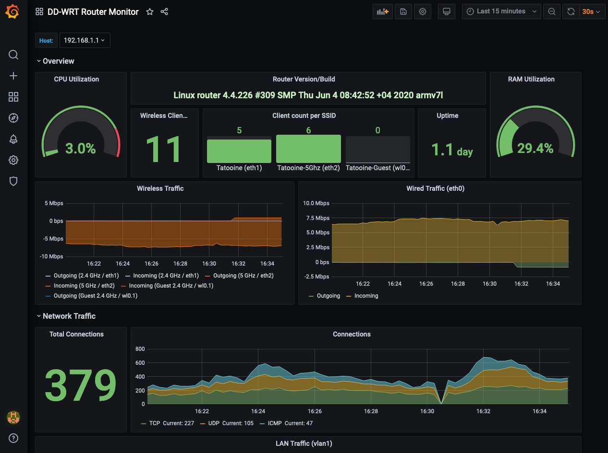

# DD-WRT Router Monitoring with Prometheus and Grafana

This stack is used to monitor a Netgear R7000P (Nighthawk) router that uses a Broadcom CPU. It might not work on different router brands or models.

## Preparing the Router

1) Set an user, password in (Administration -> Management -> Router Password) and enable SSH in (Services -> Secure Shell) to be able to copy files into the router.
2) Then [enable JFFS](https://wiki.dd-wrt.com/wiki/index.php/JFFS_File_System) in Router GUI to persist files and create the dir `/jffs/snmpd/`
3) Copy all files from `router` directory into router's `/jffs/snmpd/`
    > `scp root@192.168.1.1 router/* /jffs/snmpd`
4) Add execute permission with `chmod +x /jffs/snmpd/*.sh`
   > `ssh root@192.168.1.1 chmod +x /jffs/snmpd/*.sh`
5) Disable SNMP on the Service page of the GUI if already enabled (custom config is used)
6) Add `snmpd -c /jffs/snmpd/snmpd.conf` in the startup commands in the GUI (Administration -> Commands -> Save as Startup)
7) Reboot

## Run the Monitoring Stack

The monitoring stack is composed of snmp_exporter, Prometheus, Grafana and Alertmanager. They are run in Docker containers by using a docker-compose file.

1) Configure your router IP in the `prometheus/prometheus.yml` file `job_name -> targets` section.
2) Run `docker-compose up -d`

Grafana, Prometheus and Alertmanager will be configured with provisioned Data Source pointing to <http://prometheus:9090> and with the dashboards pre-loaded.

The historical data for Prometheus and configuration changes for Grafana are stored in Docker volumes. If required, this can be changed to the local disk.

The URLs for the stack apps are:

* Grafana: <http://localhost:3000>
* Prometheus: <http://localhost:9090>
* Alertmanager: <http://localhost:9093>
* SNMP-Exporter: <http://localhost:9116>

